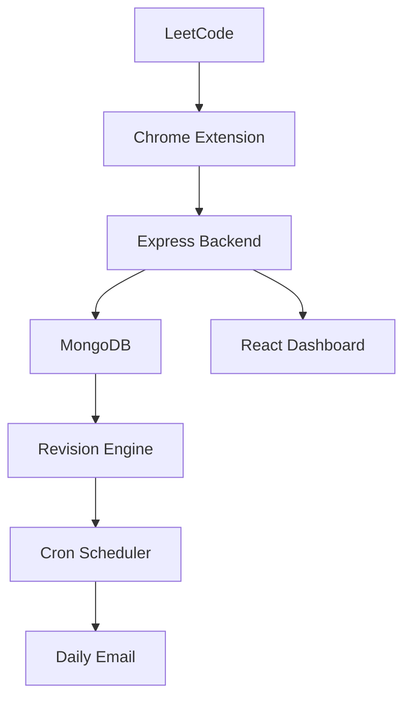
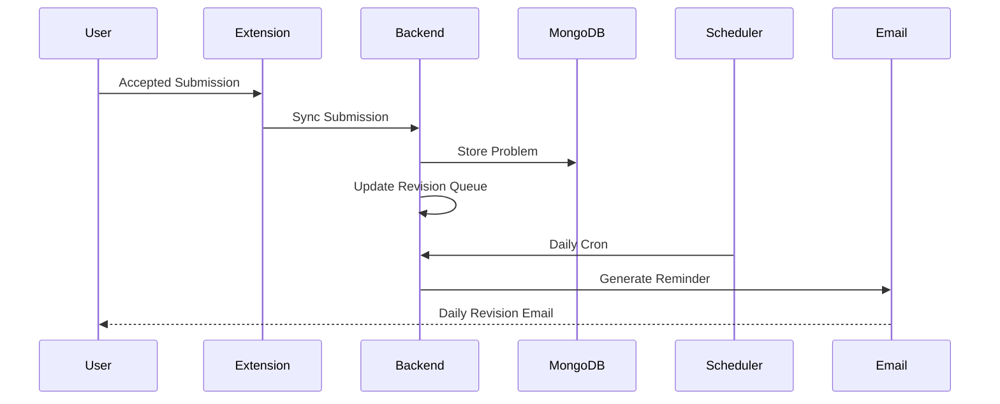

# 🚀 CodeNudge

> **An AI-powered coding revision platform that automatically captures accepted LeetCode submissions through a Chrome Extension, synchronizes them with a MERN backend, and generates personalized revision schedules with automated email reminders.**

[](https://react.dev/)
[](https://nodejs.org/)
[](https://expressjs.com/)
[](https://mongoosejs.com/)
[](https://developer.chrome.com/)
[]()
[](LICENSE)

CodeNudge is a full-stack productivity platform that helps developers **never forget solved coding problems again**.

Instead of manually tracking solved questions, the Chrome Extension automatically detects accepted LeetCode submissions, synchronizes them with the backend, and schedules intelligent revisions with daily email reminders.

---

# 🎞️ Demo Video
https://github.com/user-attachments/assets/1ad6902a-ff5c-4e1d-87e4-3ede350b97ba


# 🌟 Overview

Most developers solve hundreds of coding problems but forget many because they never revise them systematically.

CodeNudge solves this problem by automating the complete workflow.

```
Solve Problem
      ↓
Chrome Extension detects Accepted Submission
      ↓
Submission synced to Backend
      ↓
Stored in MongoDB
      ↓
Revision Queue Updated
      ↓
Daily Reminder Email Sent
      ↓
User Revises Problems
```

---

# ✨ Key Features

## 🧩 Chrome Extension

- Automatically detects accepted LeetCode submissions
- Extracts problem metadata
- Background synchronization
- Secure authentication
- One-click platform connection

---

## 💻 Full Stack Dashboard

- User Authentication
- Dashboard Analytics
- Revision History
- Connected Coding Platforms
- Daily Revision Queue

---

## 🧠 Smart Revision Engine

- Two-Queue Revision Algorithm
- Personalized revision schedule
- Automatic queue rotation
- Prevents forgetting solved problems

---

## 📧 Email Reminder System

- Daily revision emails
- Automated Cron Jobs
- Smart revision notifications
- Personalized reminders

---

## 🔐 Authentication

- JWT Authentication
- Password Hashing (bcrypt)
- Secure Cookies
- Protected APIs

---

# 🛠 Tech Stack

| Category | Technologies |
|-----------|--------------|
| Frontend | React, React Router, Axios, Framer Motion |
| Backend | Node.js, Express.js |
| Database | MongoDB, Mongoose |
| Authentication | JWT, bcrypt |
| Validation | Zod |
| Extension | Chrome Extension Manifest V3 |
| Email | Resend API |
| Scheduling | Node Cron |
| Charts | Recharts |

---

# 🏗 System Architecture



---

# 🔄 Complete Workflow



---

# ⚙️ How It Works

## Step 1

User signs up.

---

## Step 2

User connects their LeetCode account.

---

## Step 3

Chrome Extension automatically detects accepted submissions.

---

## Step 4

Submission details are sent to the backend.

Information stored includes:

- Problem Name
- Difficulty
- Platform
- Submission Time

---

## Step 5

The Revision Engine schedules future revisions using a two-queue strategy.

---

## Step 6

Node Cron runs every day.

---

## Step 7

Users receive personalized revision reminders through email.

---

# 📁 Project Structure

```
CodeNudge

├── CodeNudge-Frontend
│   ├── src
│   │   ├── components
│   │   ├── pages
│   │   ├── hooks
│   │   ├── context
│   │   ├── services
│   │   └── assets
│   └── public
│
├── CodeNudge-Backend
│   ├── controllers
│   ├── routes
│   ├── services
│   ├── repositories
│   ├── models
│   ├── middlewares
│   ├── validators
│   ├── config
│   └── utils
│
└── CodeNudge-Extension
    ├── popup
    ├── services
    ├── utils
    ├── background.js
    ├── content.js
    └── manifest.json
```

---

# 📂 Folder Explanation

## 🖥 Frontend

Responsible for

- Dashboard
- Authentication
- Revision UI
- Analytics
- Platform Connections

---

## ⚙️ Backend

Implements

- REST APIs
- JWT Authentication
- Business Logic
- Repository Pattern
- Revision Scheduling
- Email Automation

---

## 🧩 Chrome Extension

Responsible for

- Detecting Accepted Submissions
- Capturing Problem Metadata
- Sending Data to Backend
- User Authentication

---

# 🚀 Installation

## Clone Repository

```bash
git clone https://github.com/Aditya2584/CodeNudge.git
```

---

## Frontend

```bash
cd CodeNudge-Frontend

npm install

npm run dev
```

---

## Backend

```bash
cd CodeNudge-Backend

npm install

npm run dev
```

---

## Chrome Extension

1. Open Chrome

2. Navigate to

```
chrome://extensions
```

3. Enable Developer Mode

4. Click

```
Load Unpacked
```

5. Select

```
CodeNudge-Extension
```

---

# 🔐 Environment Variables

Backend

```
PORT=

MONGO_URI=

JWT_SECRET=

RESEND_API_KEY=

CLIENT_URL=
```

Frontend

```
VITE_API_BASE_URL=
```

---

# 📸 Demo

## Showcase

- User Signup/Login
- Connect LeetCode
- Chrome Extension Installation
- Accepted Submission Detection
- Dashboard Synchronization
- Revision Queue
- Daily Email Reminder

Recommended demo duration:

**90–120 seconds**

---

# 💡 Future Improvements

- GitHub Problem Tracking
- Codeforces Integration
- HackerRank Integration
- AI-generated Revision Notes
- Flashcards
- Difficulty Prediction
- Spaced Repetition Algorithm
- Mobile Application
- Team Leaderboards

---

# 🤝 Contributing

Contributions are welcome!

1. Fork the repository

2. Create a feature branch

```bash
git checkout -b feature/new-feature
```

3. Commit changes

```bash
git commit -m "Add amazing feature"
```

4. Push changes

```bash
git push origin feature/new-feature
```

5. Open a Pull Request

---

# 📜 License

Distributed under the MIT License.

---

# 👨‍💻 Author

**Aditya Kumar Singh**

GitHub: https://github.com/Aditya2584

If you found this project useful, consider giving it a ⭐.
